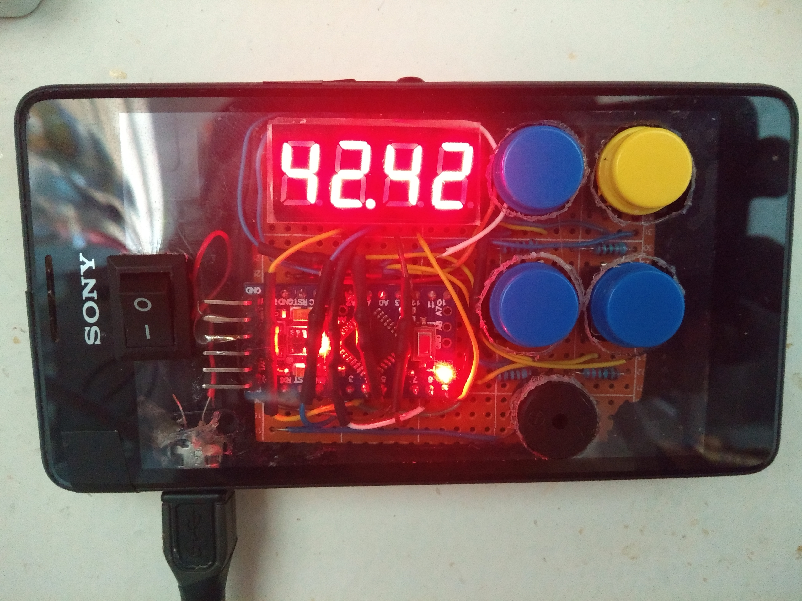

# arduino_timer
A simple timer made with the pro mini.

A very basic timer, I tried to challenge myself and not reference other projects or use any libraries so there may be some issues here and 
there but for the most part I am quite happy with it. I decided ofcourse to use `millis()` to keep track of the time elapsed, if the value returned 
from `millis()` would overflow that would be fine as the start value used to measure when a second has elapsed would also overflow and the time
left is not adversely affected.

  

## Functionality 
There are four buttons to the right:  
top left = start / pause  
top right = unit change, ie inc / dec ones or tens. The unit that the user is editing will flash.  
bottom left = inc unit  
bottom right = dec unit  

The max time the timer can count down from is 99 min, one could ofcourse increase this by shifting the decimal place
but this wasn't necessary for the application, ie a basic timer used in the kitchen. 

The user can pause the timer and edit the timer and resume, once the time is elapsed the buzzer will sound and the 
only way to stop the buzzer is to turn it off. We needed a buzzer that would work like this as
some of the timers we used would eventually stop, this will basically never stop.

Then of course there is the power button on the far left. Power comes from a typical 5v phone charger.
